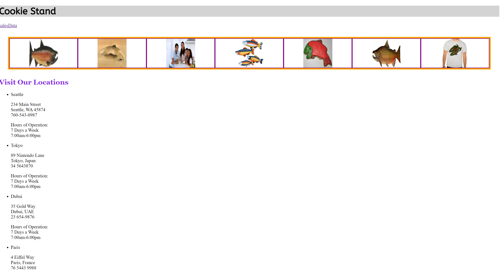
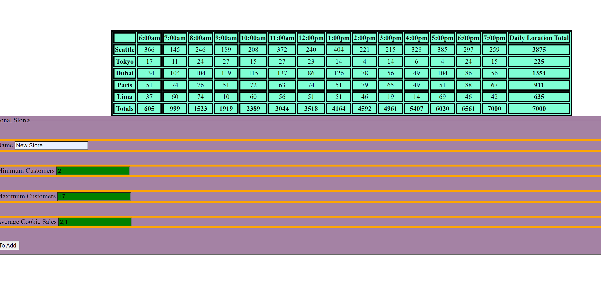
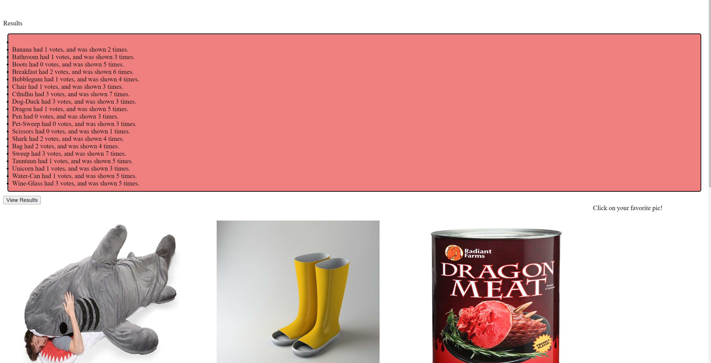
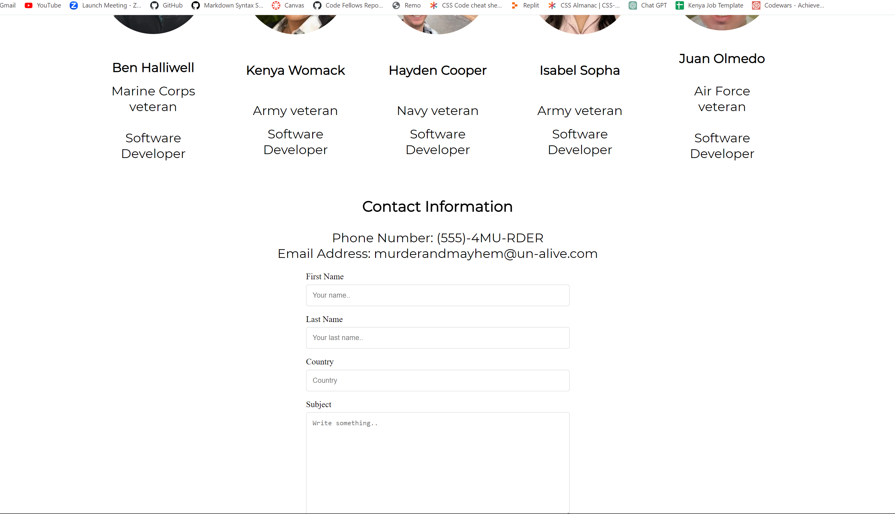

# Sodtware Engineer

## Full Stack Software Developer

I have a mosaic background but most recently I was a teacher's aide at a high school. I began to learn software development because I want to make more money in a career I love and tech is very interesting to me. I picked this skill to be able to find more ways to build websites and to be able to make my clients love my ideas. The ideal environment is to work from home. My previous experience in customer service is definitely a helpful boost in my tech career.

One of the things that excite me the most about tech are the infinite possibiliies of the jobs that I can choose from. Another exciting aspect in tht there is so much to continue learning even after a job is chosen.

;
;
;
;
;
;
;
;
;
;
;

